# Dokumentacja REST API dla mikrousług obsługujących system sklepu.

## Opis

Projekt został stworzony na bazie trzech mikroserwisów: product-service, stock-service oraz order-service.
Serwis produktów zarządza bazą danych produktów dostępnych do zakupu w sklepie. Serwis magazynu zarządza ilością
dostępnych produktów w magazynie. Serwis zamówień komunikuje się z pozostałymi serwisami w celu utworzenia pary 
produkt : ilość, przechowuje produkty i ich ilości w jednym obiekcie zamówienia.

## Testowanie

API najlepiej testować przy użyciu programu POSTMAN. Tak też postąpie w przypadku tej dokumentacji.

## Product - service

Aplikacja uruchamiana jest na porcie 8080.

### GET /api/products

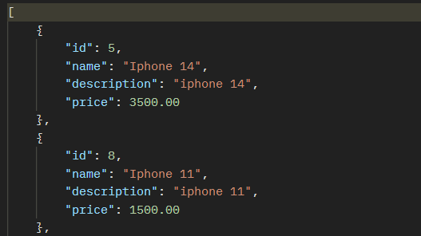

Status: 200 OK

Endpoint wyświetla listę wszystkich produktów dostępnych w sklepie oraz dodatkowe informacje o nich.

### GET /api/products/id/{id}

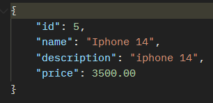

Status: 200 OK

Endpoint wyświetla produkt o podanym {id}.

### GET /api/products/name/{name}
{name} w formacie: Iphone%2016

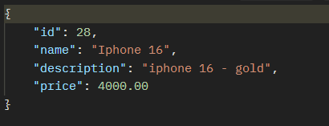

Status: 200 OK

Endpoint wyświetla produkt o podanym {name}.

### POST /api/products

{ \
    "name": "Iphone SE", \
    "description": "iphone se - silver", \
    "price": 500.00 \
}

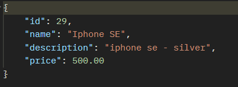

Status: 201 Created

Endpoint dodaje do bazy danych json przekazany w metodzie POST.

### PUT /api/products/{id}

{ \
    "name": "Iphone SE", \
    "description": "iphone se - golden rose", \
    "price": 500.00 \
}

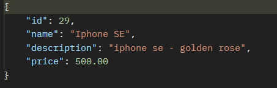

Endpoint aktualizuje produkt o podanym {id} według schematu w wysłanym jsonie.

Status: 200 OK

### DELETE /api/products/{id}

Endpoint usuwa produkt o podanym {id}.

Status: 200 OK

## Walidacja

### Nieprawidłowy URL

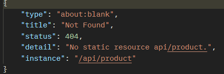

Status: 404 Not Found

### Próba dodania produktu istniejącego w bazie danych.

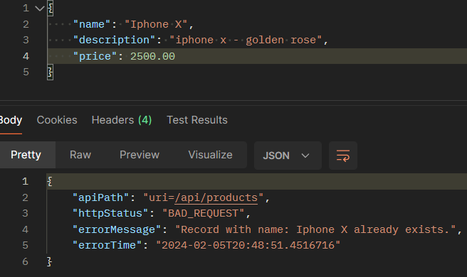

### Próba edycji produktu na taki, który już istnieje.

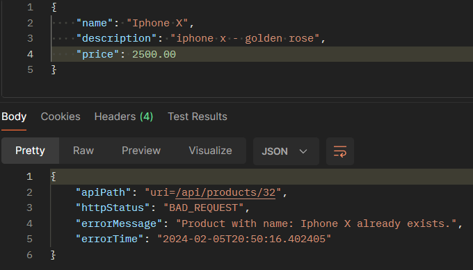

### Próba zaktulaizowania produktu o nieistniejącym id.

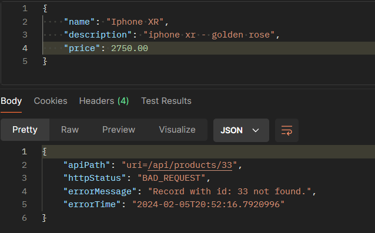

### Próba usunięcia produktu o nieistniejącym id.

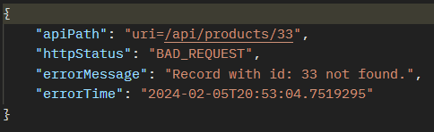

## Stock - service

Aplikacja uruchamiana jest na porcie 8081.
Stock - service komunikuje się z produkt - service, aby dowiedzieć się czy wprowadzane produkty w obiektach
typu stock znajdują się w bazie danych.

### GET /api/stocks

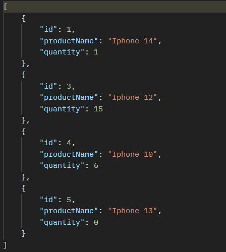

Endpoint zwraca informacje o produktach znajdujących się w bazie danych w połączeniu 
z ich ilością dostępna w bazie danych.

Status: 200 OK.

### Pozostałe endpointy działają dokładnie tak samo, jak w przypadku product - service.

## Walidacja

### Nieprawidłowy URL

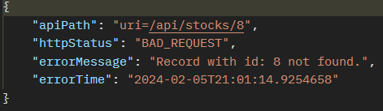

### Próba uwtorzenia obiektu z nieistniejącym w bazie danych produktów produktem.

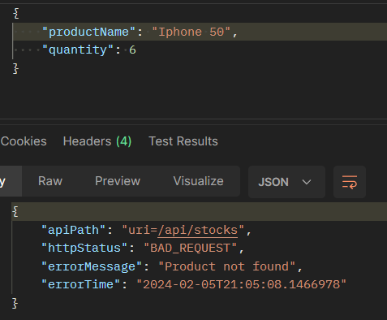

### Próba uwtorzenia obiektu z produktem już istniejącym w bazie danych stock.

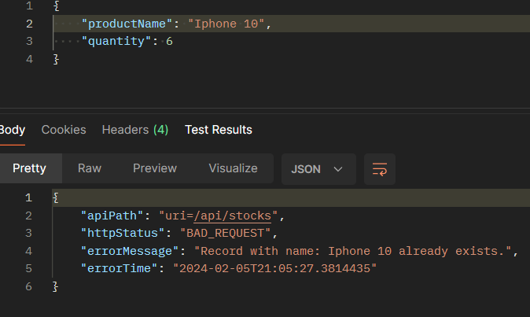

### Próba wprowadzenia niepoprawnych danych w metodzie PUT.

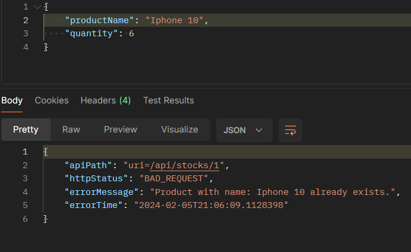

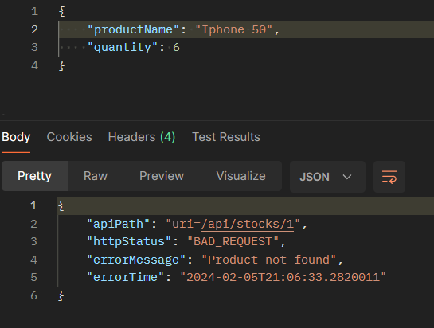

## Order - service

Aplikacja uruchamiana jest na porcie 8082.
Order - service komunikuje się z product - service, aby sprawdzić, czy produkt dodawany w obiekcie order
znajduje się w bazie danych produktów. Order - service komunikuje się również ze stock - service, aby sprawdzić, czy 
produkty są dostępne.

### GET /api/orders

### GET /api/orders/{id}

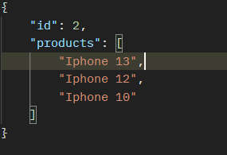

### POST /api/orders

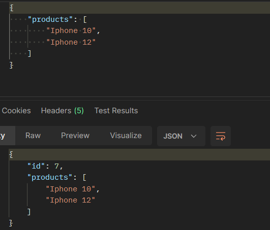

### PUT /api/orders/{id}

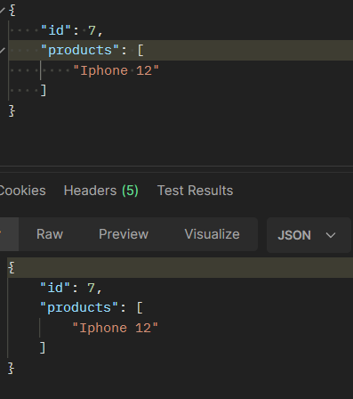

### DELETE /api/orders/{id}

Status: 200 OK

## Walidacja

### Próba dodania produktu, którego quantity wynosi 0:

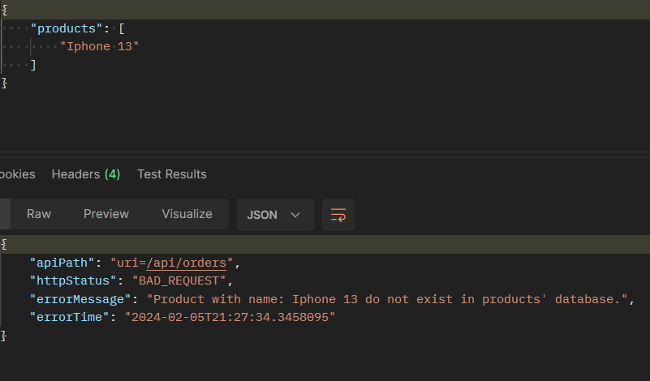

### Próba zaktualizowania na produkt, którego quantity wynosi 0:

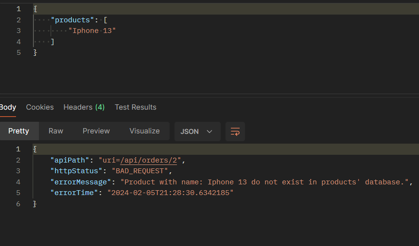

## Dodatkowe funkcjonalności

Do każdego serwisu dołączony jest MVC Controller umożliwiający edycję i przeglądanie danych w przeglądarce.
Order - service nie posiada możliwości dodawania nowych danych w przeglądarce. Serwisy nie posiadają żadnego sposobu autoryzacji.
Do przechowywania danych zostały użyte 3 instancje bazy H2.

